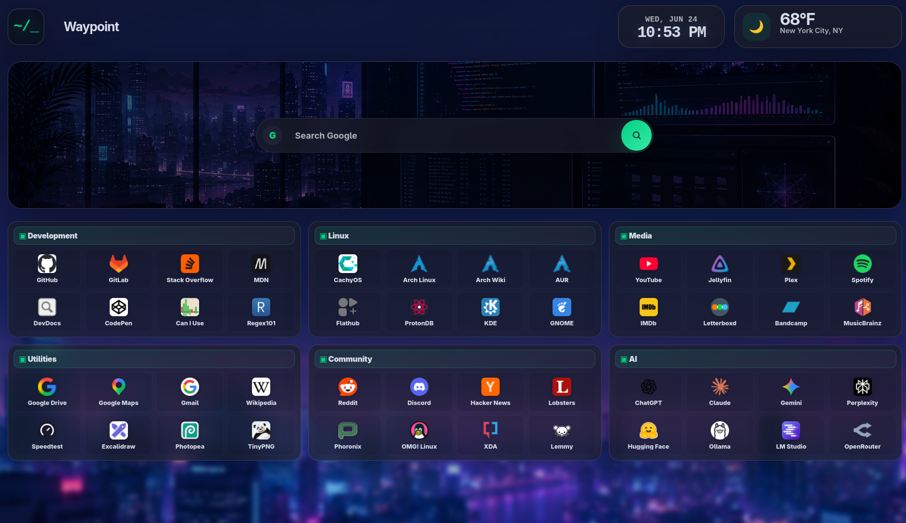
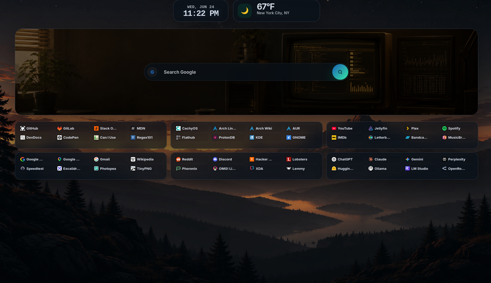
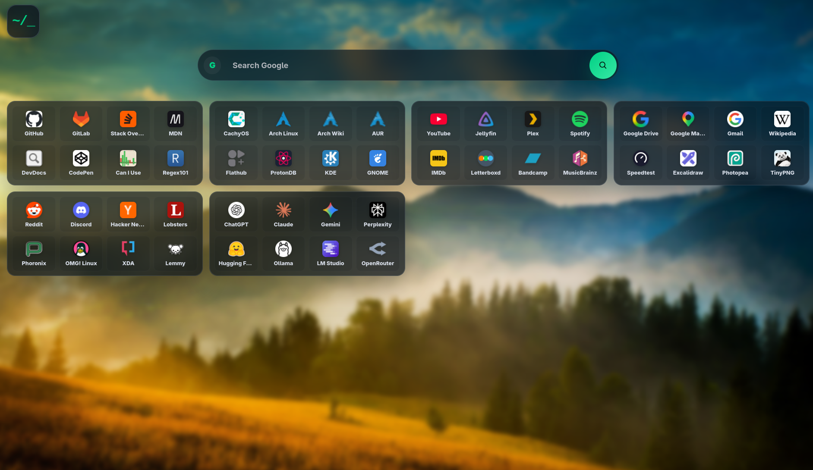
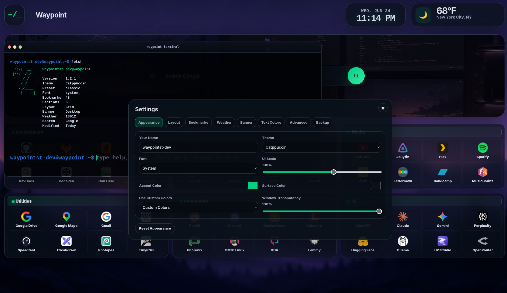

# Waypoint

<div align="center">


### A beautiful, bookmark-first browser start page inspired by Linux desktops, featuring Workspaces, an integrated terminal, and thoughtful customization.

<p>
  
  
  
</p>

</div>

---

## Project Principles

Waypoint is built around a few simple ideas:

- Bookmarks come first.
- Workspaces provide structured customization.
- Beautiful defaults matter.
- Simplicity is preferred over feature count.
- Every feature must earn its place.

Waypoint is intentionally focused on being an exceptional browser start page rather than a general-purpose dashboard.

---

## Highlights

### Workspace

- Workspace-based layout engine
- Visual workspace editor
- Structured widget placement
- Multiple page layouts including classic, top bar, and bottom bar

### Bookmarks

- Drag-and-drop bookmark organization
- Custom bookmark sections
- Fast, elegant bookmark launching

### Customization

- Themes
- Fonts
- Advanced color customization
- Multiple page layouts
- Custom CSS
- Local-first configuration

### Terminal

- Integrated Linux-inspired terminal
- Built-in commands
- Fast keyboard-driven interaction

---

## Screenshots

<div align="center">



</div>

<details>
<summary><strong>More Screenshots</strong></summary>

<div align="center">








</div>

</details>

---

## Installation

Clone the repository:

```bash
git clone https://github.com/waypointsp-dev/waypointsp.git
```

Or download the latest release from the Releases page.

Open `index.html` in your browser.

No installation required.

---

## Terminal

The integrated terminal is one of Waypoint's signature features.

Inspired by the Linux command line, it provides a fast and enjoyable way to configure and interact with Waypoint using built-in commands.

Type `help` to get started.

---

## Customization

Customize Waypoint through Workspaces, themes, fonts, colors, multiple page layouts, widget placement, and custom CSS without editing the source code.

All configuration is stored locally. No backend is required.

---

## Roadmap

### Completed

- ✅ v1.0 Foundation
- ✅ v1.1 Personalization
- ✅ v1.2 Terminal Upgrade
- ✅ v1.3 First Experience & Onboarding
- ✅ v1.4 Workspace Foundation

### In Progress

- 🚧 v1.5 Hero Evolution


---

## License

Copyright (C) 2026 waypointsp-dev

Licensed under the GNU General Public License v3.0 or later.

See the LICENSE file for details.
